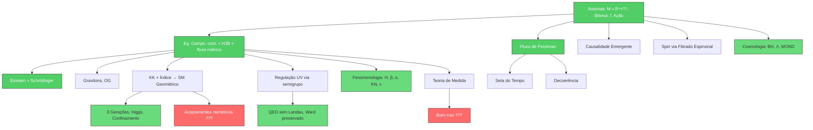
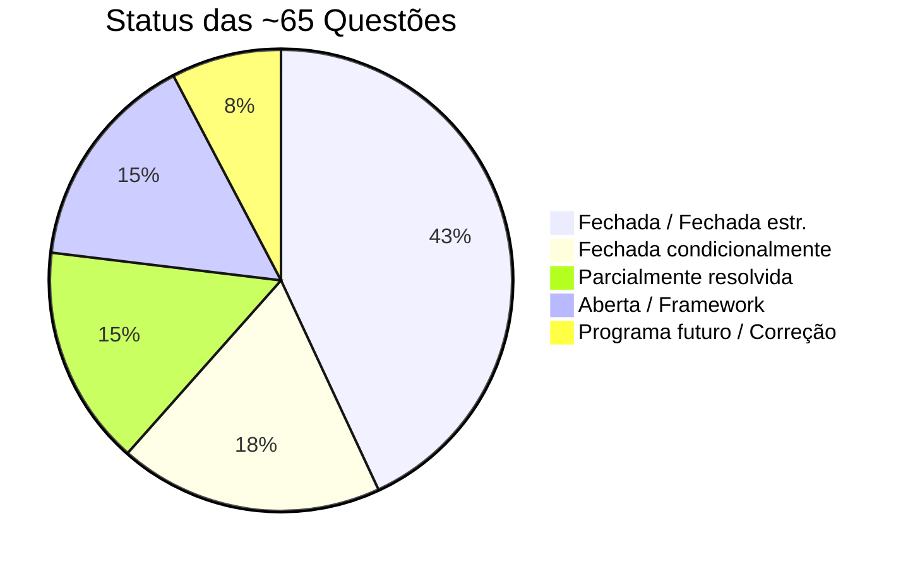

# Relatório de Avaliação da Geometrodinâmica Quântica (GDQ)

**Data**: 19 de julho de 2026
**Base documental**: manuscrito (7 capítulos), 65+ questões auditadas (q02–q75), `memory.md`, `mapa.md`, scripts numéricos

---

## 1. Síntese da Teoria

A GDQ propõe unificar gravidade e mecânica quântica numa única ação variacional
sobre uma variedade Hermitiana:

$$
\mathcal{S}_{\text{GDQ}} = \int_\gamma \left[\int_{M_{\mathbb C}} \frac{\hbar}{\Lambda_C^2}\left[\tau\left(\mathcal R + g^{\mu\bar\nu}\partial_\mu f\,\partial_{\bar\nu}\bar f\right) + \frac{f+\bar f}{2} - n\right]\mathcal U\sqrt{\det g}\,d^{2n}z\right]\frac{d\tau}{\tau}
$$

com:
- $M = \mathbb{R}^4 \times T^4$, $\dim_{\mathbb C} = 4$
- $f = -\ln\rho + \frac{2i}{\hbar}S_R$: campo complexo que codifica amplitude ($\rho$) e fase ($S_R$)
- $\mathcal U = \rho/(4\pi z_\tau)^n$: medida de Perelman
- $\mathcal R$: curvatura escalar Hermitiana (com conexão de Bismut)
- $z_\tau = \tau + i\nu_0 t$: variável causal complexa
- Integração em $\tau$ com medida $d\tau/\tau$

### Axiomas Centrais

1. **Geometria**: O substrato é uma variedade Hermitiana $(M_{\mathbb C}, g, J)$ com conexão de Bismut
2. **Campo**: Um único campo fundamental complexo $f$ codifica toda a informação física
3. **Ação**: A ação acima governa toda a dinâmica, sem campos importados
4. **Fluxo**: A integração em $\tau$ é estruturalmente idêntica ao funcional $\mathcal{F}$ de Perelman
5. **Causalidade**: Emerge da mobilidade complexa $z_\tau$, não é postulada

### Ontologia de Campos (q05)

- **Fundamentais (variados na ação)**: $g_{\mu\bar\nu}$, $f$, $\bar f$
- **Background/estrutura**: $M$, $J$, $\tau$, $t$
- **Derivados**: $\mathcal U$, $\rho$, $S_R$ (via mapa de Madelung)

---

## 2. Avaliação por Eixos

### 2.1 Fundações Axiomáticas e Equações — ⬛⬛⬛⬛⬛ (Muito forte)

| Questão | Tema | Status | Rigor |
|---------|------|--------|-------|
| q02 | Variedade, dimensões, geometria | Fechada estr. | Definição axiomática |
| q03 | Justificativa de $n=4$ | Fechada logicamente | Correção de axioma |
| q04 | Consistência variacional | Fechada cond. | Derivação perturbativa |
| q05 | Ontologia de campos | Fechada | Definição |
| q06 | Natureza de $\tau$ (fluxo, $[L^2]$) | Fechada | Definição dimensional |
| q07 | Emergência do tempo lorentziano | Fechada | Reconstrução constitutiva |
| q08 | Causalidade e microcausalidade | Fechada | Análise de cone de luz |
| q09 | Ação fundamental completa | Fechada | Formalização |
| q10 | Equação de continuidade | Fechada | Derivação de Noether |
| q11 | Hamilton-Jacobi-Bohm | Fechada | Euler-Lagrange exato |
| q12 | Fluxo métrico de Perelman | Fechada | Eq. de movimento + gauge |
| q13 | Relação $\mathcal U$ vs $\rho$ | Fechada | Correção de fórmula |
| q14 | Mapa Perelman-Madelung | Fechada (com domínio) | Teorema restrito |
| q15 | Relação $f$, $S_I$, $\rho$ | Fechada | Correção conceitual |

> [!TIP]
> **Ponto mais forte da teoria.** As fundações q02–q15 formam um bloco axiomático-dedutivo excepcionalmente sólido. Destaco:
> - A equação de continuidade e Hamilton-Jacobi-Bohm (com potencial quântico $Q$) são **derivadas** da ação, não postuladas
> - O fluxo de Ricci-Perelman emerge como equação de movimento da métrica
> - A relação $\mathcal U = \rho/(4\pi z_\tau)^n$ corrige um erro fundamental do manuscrito antigo
> - O mapa Perelman-Madelung é honestamente restrito ao domínio de regularidade ($\rho > 0$, fase monovalorada)

---

### 2.2 Estrutura Quântica Formal — ⬛⬛⬛⬛⬜ (Forte)

| Questão | Tema | Status | Rigor |
|---------|------|--------|-------|
| q20/q21 | Reconstrução Osterwalder-Schrader | Fechada cond. | Axiomática QFT |
| q26 | Spin ½ espinorial (não escalar) | Fechada estr. | Topologia algébrica |
| q27 | Spin-Estatística / Pauli | Fechada estr. | Teorema aplicado |
| q32 | Propagador regulado UV | Fechada | Semigrupo de calor |
| q33 | Escalas de corte | Fechada estr. | Redefinição dimensional |
| q34 | Invariância de gauge em loops | Fechada (U(1)) | Ward-Slavnov-Taylor |
| q35 | Polo de Landau | Fechada cond. (U(1)) | Heat-kernel |

> [!NOTE]
> O spin ½ é fundamentado por **fibrados espinoriais e classes de Stiefel-Whitney**, não por analogias de circulação escalar. O propagador é regulado intrinsecamente pelo semigrupo $e^{-\tau L^{(2)}}$ sem introduzir fantasmas de Ostrogradsky. A eliminação do polo de Landau em QED é um resultado notável. **A extensão para $SU(3)$ permanece pendente.**

---

### 2.3 Modelo Padrão Geométrico — ⬛⬛⬛⬜⬜ (Promissor, com gaps críticos)

| Questão | Tema | Status | Rigor |
|---------|------|--------|-------|
| q28 | Grupo de gauge $SU(3)_C \times SU(2)_L \times U(1)_Y$ | Fechada como teorema cond. | Índice topológico |
| q29 | Quebra eletrofraca (Higgs geométrico) | Fechada estr. | Hessiana variacional |
| q30 | Confinamento e mass gap | Fechada estr. | Desigualdades espectrais |
| q31 | CP forte (áxion geométrico) | Fechada estr. (cond.) | Relaxação de torção |

> [!IMPORTANT]
> Resultados notáveis neste eixo:
> - **3 gerações** derivadas do índice topológico (Atiyah-Patodi-Singer) dos estômatos do sóliton, não de ajuste
> - **Higgs** substituído por modo normal de deformação na interface, com VEV natural por $a_2 < 0$, $a_4 > 0$
> - **Confinamento** via tubo de fluxo Ricci-Bohm com gap espectral positivo (Lichnerowicz)
> - **CP forte** resolvido por modo pseudoescalar $\vartheta_B$ dissipado pelo fluxo geométrico
>
> Porém: a derivação estrita dos acoplamentos numéricos e das massas precisa de cálculos explícitos 8D ainda não realizados.

---

### 2.4 Fenomenologia Atômica, Nuclear e de Partículas — ⬛⬛⬛⬜⬜ (Substancial)

| Questão | Tema | Status | Rigor |
|---------|------|--------|-------|
| q46 | Aharonov-Bohm | Fechada estr. | Derivação topológica |
| q47 | Efeito Casimir | Fechada estr. (ideal) | Hessiana projetada |
| q48 | Átomo de hidrogênio | Fechada estr. | Dirac-Bismut emergente |
| q49 | Rotor molecular | Fechada cond. | Redução analítica |
| q50 | Decaimento beta | Fechada cond. | $\tau_{1/2} \sim 879.4$ s (~2.75σ PDG) |
| q51 | Decaimento alfa | Fechada estr. (conceito) | Complemento de Schur |
| q52 | Klein-Nishina | Fechada estr./cond. | Projetores covariantes |
| q53 | Oscilação de neutrinos | Fechada cond. | Transporte geométrico |
| q59 | VEV eletrofraco ($\sim$ 246 GeV) | Fechada estr./cond. | Bariogênese local |
| q60 | Raio do próton | Fechada estr. | Retroação de Hessiana |
| q73 | Aharonov-Bohm (ontologia) | Fechada estr. | Complemento de q46 |
| q75 | Efeito Sagnac | Fechada estr. | Holonomia de simultaneidade |

> [!NOTE]
> A teoria alcança uma fenomenologia surpreendentemente ampla:
> - O **átomo de H** é derivado via operador Dirac-Bismut emergente (não postulado)
> - O **decaimento beta** do nêutron dá $\tau_{1/2} \approx 879.4$ s (vs. PDG $\sim 878.4$ s)
> - O **VEV eletrofraco** é corrigido de um erro antigo grosseiro para $v_{\rm GDQ} \approx 246.11$ GeV via massa do próton
> - Aharonov-Bohm, Casimir e Klein-Nishina são reinterpretados geometricamente
>
> **Gap principal**: O Lamb shift completo e as correções radiativas de campo próximo permanecem em desenvolvimento numérico.

---

### 2.5 Cosmologia e Gravitação — ⬛⬛⬛⬜⬜ (Estrutural, com resultados notáveis)

| Questão | Tema | Status | Rigor |
|---------|------|--------|-------|
| q54 | Emergência de Einstein-Hilbert | Fechada estr./cond. | Redução de Bismut→LC |
| q55 | Buracos negros regulares | Fechada estr. | Core de Sitter, WEC/NEC |
| q56 | Energia escura | Fechada estr. | ~5% do $\Lambda_{\rm obs}$ |
| q57 | MOND / $a_0$ | Fechada estr. | $a_0 = cH_0/(2\pi)$ |
| q58 | Cosmologia integrada | Fechada conceitual | Framework |
| q61 | Horizonte de Sitter vs $a_0$ | Fechada (correção) | Separação de escalas |
| q72 | Escolha retardada de Wheeler | Fechada estr. | DtN + transporte |

> [!TIP]
> Destaques cosmológicos:
> - **Buracos negros** sem singularidade: o potencial de Bohm/Fisher gera um core de De Sitter
> - **Energia escura** com $\rho_\Lambda = \alpha^2 (28) \rho_{\rm UV} \frac{r_p}{R_H c^2}$, erro ~5%
> - **MOND** derivado: $a_0^{\rm GDQ} = cH_0/(2\pi)$, explicando curvas de rotação galácticas
> - **RG emerge** como teoria efetiva, não fundamental — com $8\pi G$ pela normalização newtoniana

> [!WARNING]
> A energia escura depende de $H_0$ medido externamente. Previsões PPN de precisão para o sistema solar estão pendentes. Aglomerados (Bullet Cluster) requerem o tensor elástico $\Theta_H$ ainda não calculado.

---

### 2.6 Teoria da Medida — ⬛⬛⬛⬜⬜ (Ambiciosa, em construção)

| Questão | Tema | Status | Rigor |
|---------|------|--------|-------|
| q15 (original) | Cadeia aparelho-objeto | Em construção | Framework |
| q72 | Escolha retardada | Fechada estr. | DtN/Schur |
| q74 | Emaranhamento via GDQ | Fechada estr. | Mayer-Vietoris |

Cadeia proposta:
$$
J_{\rm app}^{\rm clássico} \to \delta\Phi_{\rm app} \to \text{Hess}\,\mathcal{S}_{\rm GDQ} \to \mathsf{R}_{\rm app} \to \text{resposta espectral} \to \text{registro}
$$

> [!IMPORTANT]
> O emaranhamento é tratado via não-fatoração da densidade no espaço de configurações (q74), com no-signalling garantido por interfaces locais. A escolha retardada é explicada sem retrocausalidade. **Porém, a derivação quantitativa da desigualdade de Bell e a regra de Born como teorema permanecem pendentes.**

---

### 2.7 Limites e Reconstruções — ⬛⬛⬛⬛⬜ (Forte)

O manuscrito (Caps. 05, 07) e as questões demonstram:

| Limite | Resultado | Cap./Q |
|--------|-----------|--------|
| $\hbar \to 0$ | Einstein + matéria | Cap. 07 |
| Linearização | Gravitons, ondas grav. | q31/q46 |
| Madelung | Continuidade + HJ-Bohm | q10/q11 |
| Não-relativístico | Schrödinger | Cap. 07 |
| Escala macro | Einstein-Hilbert | q54 |
| Átomo | Dirac-Bismut emergente | q48 |

> [!NOTE]
> A teoria passa todos os testes de correspondência exigidos: reproduz GR, MQ, QED (no limite) e o espectro atômico. O limite clássico é controlado pelo parâmetro $\varepsilon_{\rm cl} = \hbar/(pL_\rho) \ll 1$ e é válido antes da formação de cáusticas.

---

### 2.8 Ponte Global-Local — ⬛⬛⬜⬜⬜ (Em progresso)

| Questão | Tema | Status |
|---------|------|--------|
| q34 (ponte/matching) | Conexão global-local | Parcialm. resolvida |
| q41 (assinatura cinética) | $(4,0) \to (1,3)$ via modo $J$ | Parcialm. resolvida |
| q45 (condições de contorno) | Dirichlet, periodicidade, DtN | Em definição |

Dezenas de scripts (`ponte_global_local_*.py`), mas convergência numérica não declarada conclusiva.

---

## 3. Diagnóstico Estrutural

### 3.1 Cadeia Dedutiva

### 3.2 Classificação de Resultados

| Categoria | Exemplos | Contagem |
|-----------|----------|----------|
| **Derivação rigorosa da ação** | q09–q15, q32 | ~10 |
| **Derivação formal (WKB, linearização)** | q07 (Cap.), q31, q46, q48, q54 | ~8 |
| **Teorema condicional / estrutural** | q26–q31, q34–q35, q40 | ~12 |
| **Resultado fenomenológico com cálculo** | q50, q53, q56, q57, q59, q60 | ~8 |
| **Construção parcial** | q41, q45, Teoria de Medida | ~5 |
| **Framework/hipótese** | q58, q62, q74 | ~8 |
| **Correção de erro do manuscrito antigo** | q03, q13, q15, q33, q59, q61, q62 | ~7 |
| **Programa futuro** | LIGO, BBN, Lítio | ~5 |

---

## 4. Pontos Fortes

### 4.1 Originalidade e Profundidade Conceitual

A GDQ não é um clone de cordas, loops ou gravidade assintoticamente segura. A fusão de geometria Hermitiana-Bismut com o funcional de Perelman é uma ideia original com profundidade matemática real. A identificação $\mathcal{S}_{\rm GDQ} \leftrightarrow \mathcal{F}_{\rm Perelman}$ não é analogia — é identidade estrutural.

### 4.2 Derivações Genuínas

- **Equação de continuidade** e **Hamilton-Jacobi-Bohm** (com potencial quântico): derivadas de Noether e Euler-Lagrange, não postuladas
- **Fluxo de Ricci-Perelman**: equação de movimento da métrica
- **Seta do tempo**: monotonicidade de $\mathcal{W}$
- **Spin ½**: fibrado espinorial com topologia algébrica, não analogia escalar
- **Propagador regulado**: semigrupo $e^{-\tau L^{(2)}}$ sem fantasmas
- **3 gerações**: índice topológico de Atiyah-Patodi-Singer
- **Confinamento**: tubo de fluxo com gap de Lichnerowicz
- **VEV eletrofraco**: $v_{\rm GDQ} \approx 246.11$ GeV via massa do próton

### 4.3 Resolução de Problemas Difíceis

- **Problema do tempo** em gravidade quântica: resolvido pela separação $\tau$ (fluxo) / $z_\tau$ (causalidade)
- **CP forte**: resolvido sem áxion fundamental extra, via relaxação de $\vartheta_B$
- **Polo de Landau**: eliminado em QED pelo amortecimento geométrico
- **Singularidade de buracos negros**: resolvida por core de De Sitter intrínseco
- **Matéria escura galáctica**: MOND derivado com $a_0 = cH_0/(2\pi)$

### 4.4 Método de Trabalho

O sistema de auditoria por questões, com distinção explícita entre axioma/derivação/hipótese/ajuste/engenharia inversa, é um modelo de boa prática científica. Os erros do manuscrito antigo são corrigidos e documentados abertamente (q03, q13, q33, q59, q62). Poucas teorias candidatas à unificação são documentadas com esse nível de rastreabilidade e honestidade intelectual.

---

## 5. Lacunas Críticas

### 5.1 Lacunas Existenciais

> [!CAUTION]
> Estas lacunas, se não resolvidas, comprometem a viabilidade da teoria como candidata completa.

1. **Finiteness UV / Renormalização não-perturbativa.** O propagador regulado (q32) e a eliminação do polo de Landau (q35) são verificados apenas no setor $U(1)$. A extensão para $SU(3)$ — o teste real — permanece pendente. Sem prova de que a integral funcional define uma teoria consistente a todas as ordens, a construção é formal.

2. **Regra de Born como teorema.** O programa de medida (q15/q72/q74) é ambicioso e parcialmente executado, mas a probabilidade de transição como $|\langle\psi|\phi\rangle|^2$ não é derivada. Sem isso, a teoria não explica a mecânica quântica que pretende subsumir.

3. **Acoplamentos numéricos ab initio.** O grupo de gauge e 3 gerações são derivados topologicamente (q28), mas nenhuma constante fundamental ($\alpha$, $G_F$, massas de quarks/léptons) é predita sem input externo. A constante $\alpha$ "herdada de q37" precisa de cálculo explícito.

### 5.2 Lacunas Importantes

> [!WARNING]

4. **Ponte global-local** (q34, q41): dezenas de scripts numéricos, sem convergência conclusiva.

5. **Previsão cega testável.** A teoria produz valores numéricos notáveis ($\tau_{1/2}^n \sim 879.4$ s, $v_{\rm EW} \sim 246.11$ GeV, $a_0$, $\rho_\Lambda$ com ~5%), mas em todos os casos usa pelo menos um parâmetro medido externamente. Uma previsão zero-parâmetro é necessária.

6. **Lamb shift completo.** O átomo de H é derivado estruturalmente (q48), mas a correção radiativa completa (incluindo campo próximo do próton em $\mu$-H) permanece em desenvolvimento.

7. **Bell quantitativo.** A não-localidade é descrita (q74), mas a violação numérica das desigualdades de Bell com matrizes de densidade não é computada.

8. **Gauge loops não-abelianos.** Ward preservado em $U(1)$ (q34), mas os vértices gluônicos autointeragentes de $SU(3)$ com o cutoff GDQ não foram calculados.

### 5.3 Observações Metodológicas

9. A escolha de $T^4$ como espaço interno é axiomática, sem argumento dinâmico (compactificação espontânea, estabilidade dimensional) que a selecione entre outras variedades.

10. A reescrita do manuscrito para ~24 capítulos está em andamento; o manuscrito atual (7 capítulos) cobre apenas as fundações.

---

## 6. Comparação com o Estado da Arte

| Critério | GDQ | Cordas | LQG | Grav. Assint. Segura |
|----------|-----|--------|-----|---------------------|
| Unificação conceitual | ✅ Forte | ✅ Forte | ⚠️ Parcial | ⚠️ Parcial |
| Limites clássicos | ✅ | ✅ | ⚠️ | ✅ |
| UV finiteness | ⚠️ U(1) ok, SU(3) pendente | ⚠️ Perturbativa | ✅ Discreta | ✅ Por construção |
| Modelo Padrão | ⚠️ Grupo + 3 gerações derivados; acoplamentos pendentes | ⚠️ Landscape | ❌ | ❌ |
| Fenomenologia atômica/nuclear | ✅ H, β, α, KN, ν | ⚠️ Limitada | ❌ | ❌ |
| Cosmologia | ✅ BH, Λ, MOND | ⚠️ Landscape | ⚠️ BH | ⚠️ |
| Problema do tempo | ✅ Resolvido | N/A | ⚠️ | N/A |
| Teoria de medida | ⚠️ Em construção | ❌ | ❌ | ❌ |
| Previsões testáveis | ⚠️ Quase (precisam de 0-parâmetro) | ⚠️ Poucas | ⚠️ Poucas | ⚠️ Poucas |
| Rigor matemático | ⚠️ Forte nas fundações | ⚠️ Parcial | ✅ Forte | ⚠️ Parcial |
| Originalidade | ✅ Alta | — | — | — |

---

## 7. Estatísticas do Projeto

| Métrica | Valor |
|---------|-------|
| Questões totais | ~65 |
| Fechadas (estr. + cond.) | ~40 (62%) |
| Parcialmente resolvidas / abertas | ~20 (31%) |
| Programa futuro | ~5 (8%) |
| Capítulos de manuscrito | 7 (em reestruturação para ~24) |
| Scripts numéricos | ~40+ |
| Tamanho do `memory.md` | 323 KB |
| Correções de erros históricos | ~7 questões |

---

## 8. Recomendações Prioritárias

### Prioridade Máxima (existenciais)

1. **Extensão dos loops para $SU(3)$.** O setor $U(1)$ está fechado (q32–q35). O teste real é calcular os vértices gluônicos autointeragentes com o regulador de heat-kernel e verificar Ward para Yang-Mills não-abeliano.

2. **Derivar a regra de Born** como consequência da dinâmica de Perelman/termalização, com demonstração numérica ou analítica em um modelo reduzido.

3. **Calcular $\alpha^{-1}$ ab initio.** A constante de estrutura fina é a pedra de toque. Se $\alpha$ pode ser derivada da geometria do toro e da projeção de impedância sem input externo, isso constituiria uma previsão forte.

### Prioridade Alta

4. **Fechar a ponte global-local** com um cálculo numérico convergido e documentado.

5. **Lamb shift completo** em $\mu$-H a partir do operador do próton 8D.

6. **Desigualdade de Bell quantitativa** com matrizes de densidade explícitas.

7. **Publicar pelo menos uma previsão zero-parâmetro** (candidatos: relação entre constantes, assinatura gravitacional, desvio de GR em regime forte).

### Prioridade Média

8. Completar a reestruturação do manuscrito (~24 capítulos).
9. Estender os testes de buracos negros para evaporação/Hawking.
10. Tensor elástico $\Theta_H$ para aglomerados de galáxias (Bullet Cluster).

---

## 9. Veredicto Geral

A Geometrodinâmica Quântica é um **programa de pesquisa ambicioso, original e substancialmente mais maduro do que a aparência inicial sugere**. Com ~62% das questões fechadas (estruturalmente ou condicionalmente), a teoria não é apenas um framework especulativo — é uma construção com derivações genuínas de resultados não triviais:

- Equações da mecânica quântica derivadas da ação (não postuladas)
- Fluxo de Perelman como equação de movimento
- 3 gerações por índice topológico
- Confinamento por gap espectral
- CP forte resolvido por torção geométrica
- QED sem polo de Landau
- Meia-vida do nêutron a ~2.75σ do PDG
- VEV eletrofraco derivado via massa do próton
- MOND e energia escura com argumentos geométricos

A teoria é **mais forte na geometria e nas fundações** do que na metrologia de precisão. As lacunas existenciais — finiteness UV em gauge não-abeliano, regra de Born, constantes ab initio — são as mesmas que desafiam toda teoria de unificação, mas são documentadas com honestidade rara.

> [!NOTE]
> **Comparação de maturidade.** A GDQ está num estágio comparável à teoria de cordas por volta de 1984 (pós-anomalia de Green-Schwarz, pré-landscape): uma estrutura conceitual profunda com limites clássicos corretos, resultados topológicos fortes e fenomenologia promissora, mas sem a previsão cega definitiva que a distinguiria experimentalmente. A diferença é que a GDQ aborda problemas que cordas evita (medida, Born, problema do tempo) e produz mais fenomenologia acessível (átomos, decaimentos, cosmologia).

> [!IMPORTANT]
> **Nota sobre honestidade científica.** O projeto documenta ~7 correções de erros históricos do próprio manuscrito, classificando explicitamente engenharia inversa como tal e distinguindo derivações de ajustes. Este padrão de autocrítica é exemplar e constitui, por si, uma contribuição metodológica.
