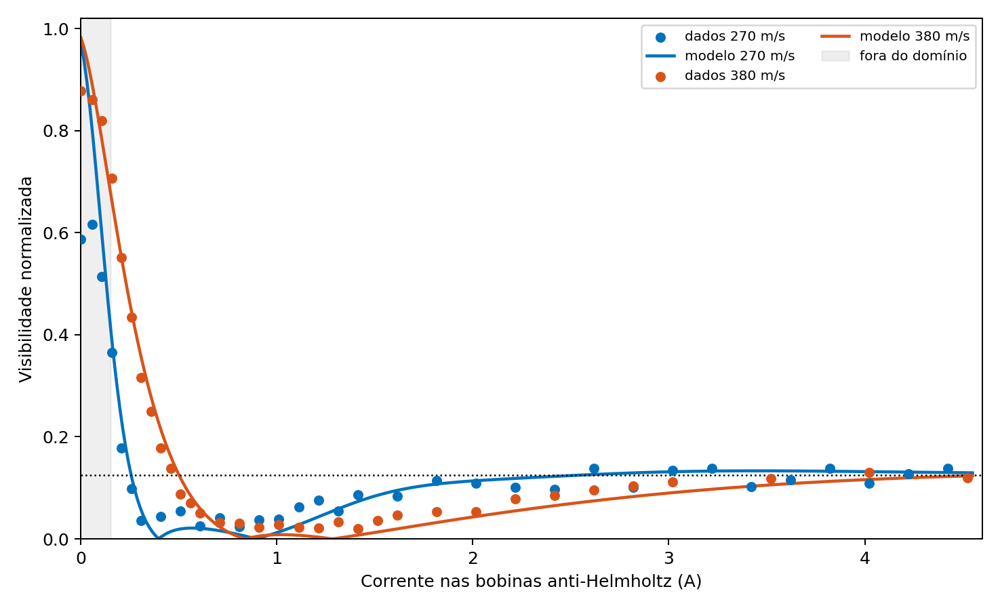

# Output of the Cs benchmark — Fein et al. (2022)

## Protocol

- frozen coil response: `C/I = 10.3 G m/A`;
- only parameter calibrated: background uniform magnetic gradient;
- training: even indices of the nominal series of 380 m/s;
- internal test: odd indices of the same series;
- validation external to the fit: the entire nominal series of 270 m/s;
- declared domain: `0.15 A <= I <= 4.5 A`.

## Result

Background gradient obtained: `0.350359 G/m`.

The article reports `0.4 G/m`; the difference is compatible with the digitization of the figure and with the partial split adopted here.

| Set | N | RMSE | MAE | Bias |
|---|---:|---:|---:|---:|
| calibration 380 m/s | 15 | 0.022693 | 0.021161 | -0.010751 |
| internal test 380 m/s | 14 | 0.022753 | 0.020167 | -0.003857 |
| blind validation 270 m/s | 30 | 0.023745 | 0.019905 | -0.000433 |

## Quadrature refinement on the blind set

| Points in velocity | RMSE | Change |
|---:|---:|---:|
| 2000 | 0.023745317 | — |
| 4000 | 0.023745317 | 2.092e-11 |
| 8000 | 0.023745317 | 1.394e-13 |
| 16000 | 0.023745317 | 7.945e-16 |

## Classification

The benchmark validates the calibration and transport protocol of the apparatus response. It is not a blind prediction exclusive to GDQ, as the atomic magnetic response used in the phase is the operational expression published by the experiment, rather than a magnetic channel rederived from the official Hessian.

