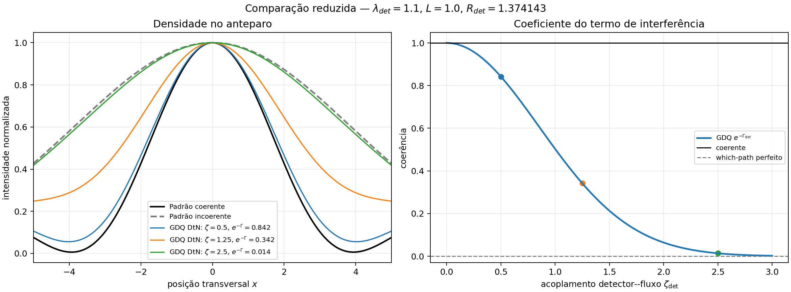

# Saída — comparação GDQ reduzida vs padrão

Classificação: comparação fenomenológica/controlada no setor Madelung em fundo fixo.

## O que foi comparado

1. padrão coerente: duas gaussianas com termo cruzado completo;
2. padrão incoerente: mistura `I1+I2`;
3. GDQ reduzida: termo cruzado multiplicado por `exp(-Gamma_det)`.

## Parâmetros

- `lambda_det = 1.1`
- `L = 1.0`
- `R_det = 1.374142841025`
- `C_path = 1.0`

## Tabela

| zeta_det | Gamma_det | exp(-Gamma_det) |
|---:|---:|---:|
| 0 | 0.000000000 | 1.000000000 |
| 0.5 | 0.171767855 | 0.842174657 |
| 1.25 | 1.073549095 | 0.341793305 |
| 2.5 | 4.294196378 | 0.013647535 |

## Figura

## Leitura

A GDQ reduzida coincide com o padrão coerente quando `zeta_det=0` e tende ao padrão incoerente quando `Gamma_det` cresce. O diferencial não é a existência das franjas, mas a lei geométrica de perda de coerência por impedância DtN/Schur:

$$
\Gamma_{\rm det}=\frac12\zeta_{\rm det}^2C_{\rm path}\lambda_{\rm det}\coth(\lambda_{\rm det}L).
$$
