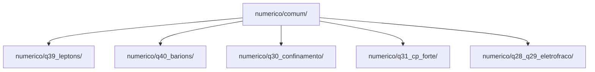

# Plano de Implementação: Avaliação Numérica Multi-Camadas da GDQ

Este plano estabelece a estrutura de diretórios, a metodologia de cálculo e a ordem de prioridades para a validação computacional rigorosa das previsões físicas da Geometrodinâmica Quântica (GDQ/KPSC).

---

## 1. Estrutura do Pacote Numérico Mínimo

Os códigos numéricos serão organizados no diretório `numerico/` para isolar a infraestrutura de cálculo da documentação teórica do manuscrito.



### Arquitetura de Pastas

* **`numerico/comum/`**: Módulos compartilhados e utilitários genéricos.
  * `quadratura.py`: Integração em $S^3$, $T^n$ e ciclos internos generalizados.
  * `operadores.py`: Discretização por diferenças finitas e elementos finitos de operadores diferenciais com métricas não triviais.
  * `contorno.py`: Funções para aplicar condições de contorno (Regulares, Robin, Dirichlet, Neumann).
  * `solvers.py`: Algoritmos de autovalores/autovetores e busca de raízes.
  * `analise.py`: Ferramentas para estudo de convergência de malha ($L^2$ e $L^\infty$) e exportação automática de tabelas LaTeX/Markdown.
* **`numerico/q39_leptons/`**: Solvers espectrais para o espectro de massas dos léptons.
* **`numerico/q40_barions/`**: Rotinas para fatores de forma, raios de carga e momentos magnéticos.
* **`numerico/q30_confinamento/`**: Simulação e cálculo de Wilson loops na rede elástica interna.
* **`numerico/q31_cp_forte/`**: Cálculo da suscetibilidade topológica e do momento de dipolo elétrico do nêutron.
* **`numerico/q28_q29_eletrofraco/`**: Cálculo das normas das Killing-conexões e espectro de massas dos bósons vetoriais.

---

## 2. Ficha Técnica Padrão de Cálculo

Antes da implementação de qualquer solver, cada questão deve ser formalizada por meio de uma **Ficha de Definição Operacional** para garantir que a saída numérica possua uma correspondência direta com as equações de campo da GDQ.

> [!IMPORTANT]
> A Ficha de Definição Operacional deve conter:
> * **Operador:** A forma diferencial ou operador diferencial covariante explícito.
> * **Domínio:** A variedade de integração (incluindo dimensões física e interna).
> * **Medida:** A medida de Perelman-Bismut $e^{-f}\sqrt{g}\,d^Dx$ adaptada.
> * **Contorno:** Condições de colagem física e regularidade nos polos ou fronteiras de estômatos.
> * **Normalização:** A fixação de escala ou calibração de volume.
> * **Observável:** A grandeza experimental de comparação.

---

## 3. Fases de Implementação

### Fase 1: Consolidação de Léptons (Q39)

A primeira etapa consiste em unificar os solvers preliminares de massas leptônicas para validar a infraestrutura comum.

1. **Ficha Técnica (Q39):**
   * **Operador:** $L_\ell = -\frac{d^2}{d\chi^2} - 2\cot\chi\frac{d}{d\chi} + V_{\text{eff}}(\chi)$.
   * **Domínio:** $\chi \in [0, \pi]$.
   * **Medida:** $\sin^2\chi \, d\chi$ (medida radial de $S^3$).
   * **Contorno:** Regularidade nos polos ($\chi=0, \pi$) ou condições de Robin na fronteira do estômato finito $\epsilon_0$.
   * **Observáveis:** Razões de massa $M_\mu/M_e$ e $M_\tau/M_e$.
   * **Metas de Teste:** Reproduzir as razões de CODATA ($206.768$ e $3477.15$).

2. **Cronograma Técnico (Q39):**
   * Unificar `compare_boundaries_q39.py` e o solver térmico em `numerico/q39_leptons/`.
   * Gerar tabela oficial de autovalores comparando os cenários:
     * **Reg-Reg** (Massa global no espaço regular);
     * **Robin-Reg** e **Robin-Robin** (Deslocamento local devido à deformação de estômatos);
     * **Térmico** (Acoplamento com o ciclo $S^1_\beta$ do espaço de Einstein).
   * **Critério de Aceitação:** Erro relativo residual global $\epsilon < 10^{-3}$ frente às razões CODATA.

---

### Fase 2: Observáveis Bariônicos (Q40)

Desenvolvimento de rotinas fenomenológicas para extração de observáveis físicos do próton e nêutron a partir da solução de sela solitônica.

1. **Ficha Técnica (Q40):**
   * **Entradas:** Densidades radiais de carga elétrica $\rho_E^B(\chi)$ e momento magnético $\rho_M^B(\chi)$ calculadas a partir do solíton trimodal ($n_B=3$).
   * **Observáveis:** Fatores de forma elétricos e magnéticos $G_E^p(q^2)$, $G_M^p(q^2)$, $G_E^n(q^2)$, $G_M^n(q^2)$, raio de carga $r_B$ e momentos magnéticos anômalos $\mu_p, \mu_n$.

2. **Rotina de Cálculo:**
   * Implementar a transformada de Fourier esférica para obter os fatores de forma:
     $$G_{E,M}^B(q^2) = \int_{\epsilon_B}^{\pi} \rho_{E,M}^B(\chi) j_0(q R_B \chi) \, d\chi$$
   * Normalizar os fatores de forma eletrofracos no limite estático:
     $$G_E^p(0) = 1, \qquad G_E^n(0) = 0$$
   * Computar a inclinação inicial para extrair o raio de carga de carga:
     $$\langle r_B^2 \rangle = -6 \frac{d G_E^B(q^2)}{d q^2} \bigg|_{q^2=0}$$
   * Gerar curvas de comparação com dados de espalhamento elástico elétron-próton.

---

### Fase 3: Confinamento e Tensão de String (Q30)

Simulação da formação do tubo de fluxo cromodinâmico na subvariedade interna $\mathfrak{su}(3)$.

1. **Ficha Técnica (Q30):**
   * **Operador:** Holonomia ordenada por caminho (Exponente de Path-Ordered):
     $$W(C) = \operatorname{Tr} \mathcal{P} \exp \left( i \oint_C A \right)$$
   * **Domínio:** Variedade elástica interna com conexões de Ehresmann associadas a Killing-campos $A \in \Omega^1(N, \mathfrak{su}(3))$.
   * **Observável:** Tensão de string $\sigma$ e decaimento de área de Wilson loops.

2. **Rotina de Cálculo:**
   * Discretizar trajetórias retangulares de tamanho $R \times T$ na subvariedade interna.
   * Computar numericamente a holonomia $\langle W(C) \rangle$ sob o fluxo geométrico relaxado.
   * Realizar o ajuste linear da área e perímetro:
     $$-\log \langle W(C) \rangle = \sigma \cdot A(C) + \mu \cdot P(C) + c + o(1)$$
   * **Critério de Aceitação:** Verificação de que $\sigma > 0$ com decaimento exponencial de área dominante sobre o termo de perímetro.

---

### Fase 4: Problema CP Forte e Massa do Áxion (Q31)

Avaliação da suscetibilidade topológica do vácuo da GDQ e sua conexão com a física do áxion.

1. **Ficha Técnica (Q31):**
   * **Operador:** Densidade de carga topológica $q(x) = \frac{1}{32\pi^2} F_{\mu\nu}^a \tilde{F}^{a\,\mu\nu}$.
   * **Observável:** Suscetibilidade topológica $\chi_{\text{top}}$ e momento de dipolo elétrico residual do nêutron (EDM).

2. **Rotina de Cálculo:**
   * Computar a energia efetiva do vácuo $E(\theta)$ sob fluxo geométrico com termo $\theta$ topológico.
   * Extrair a curvatura na origem por diferenciação numérica:
     $$\chi_{\text{top}} = \frac{\partial^2 E(\theta)}{\partial \theta^2} \bigg|_{theta=0}$$
   * Estimar a massa do áxion físico $m_a$ usando a relação de Witten-Veneziano adaptada:
     $$m_a^2 f_B^2 = \chi_{\text{top}}$$
   * Computar o EDM residual do nêutron induzido pela distorção geométrica de $\theta_{\text{eff}}$.

---

### Fase 5: Setor Eletrofraco e Massas dos Bósons de Gauge (Q28 / Q29)

Redução dimensional dos setores de calibre para calcular os acoplamentos efetivos e as massas dos bósons $W$ e $Z$.

1. **Ficha Técnica (Q28/Q29):**
   * **Operadores:** Projetores quirais e Killing-campos de gauge $\xi_C, \xi_W, \xi_Y$.
   * **Observáveis:** Acoplamentos de gauge $g_s, g, g'$, escala eletrofraca $v$, e massas $m_W, m_Z$.

2. **Rotina de Cálculo:**
   * Calcular as constantes de acoplamento efetivas integrando os Killing-campos na fibra interna $K$:
     $$\frac{1}{g_i^2} = \mathcal{N}_i \int_K |\xi_i|^2 e^{-f} \sqrt{g} \, d^n y$$
   * Minimizar o potencial efetivo de Higgs geométrico para extrair a escala de vácuo:
     $$v^2 = -\frac{2 a_2}{a_4}$$
   * Computar as massas físicas:
     $$m_W = \frac{g v}{2}, \qquad m_Z = \frac{v}{2}\sqrt{g^2 + g'^2}$$

---

## 4. Protocolo de Validação em Três Níveis

Cada etapa numérica deve obrigatoriamente submeter-se ao protocolo abaixo antes de ser documentada.

```text
+--------------------------------------------------------------+
|                     PROTOCOLO DE VALIDAÇÃO                   |
+--------------------------------------------------------------+
| NÍVEL 1: Comparação Analítica                                |
|   -> Validar o solver contra casos limite fechados           |
|      (Ex: Q39 Reg-Reg deve reproduzir Rosen-Morse).          |
+--------------------------------------------------------------+
| NÍVEL 2: Estudo de Convergência                              |
|   -> Rodar simulações com malhas crescentes                  |
|      (N = 500, 1000, 2000, 4000...).                         |
|   -> Verificar convergência de Cauchy e taxas L2/L-infinito. |
+--------------------------------------------------------------+
| NÍVEL 3: Confronto Físico                                    |
|   -> Comparar os resultados com os valores CODATA/PDG        |
|      somente após fixar normalizações e domínios.            |
+--------------------------------------------------------------+
```

---

## 5. Próximos Passos Imediatos

Para dar início ao plano sem interferir no manuscrito atual:

1. Criar o diretório `numerico/` na raiz do workspace.
2. Escrever um arquivo `numerico/README.md` documentando a arquitetura global e as convenções adotadas.
3. Criar a subpasta `numerico/q39_leptons/` e inicializar os scripts de teste unificados.
