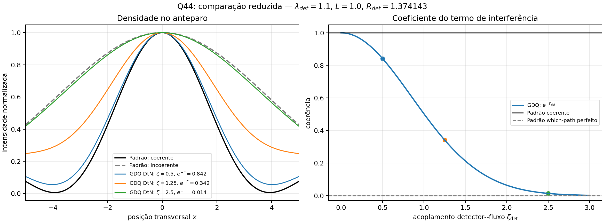

# Q44 — comparação gráfica GDQ reduzida vs teoria padrão

## Classificação

Comparação fenomenológica/controlada no setor Madelung em fundo fixo. Não é evolução métrica completa da GDQ.

## O que foi comparado

1. Teoria padrão coerente: duas gaussianas superpostas, sem detector de caminho.
2. Teoria padrão incoerente: mistura `I1 + I2`, equivalente a detector de caminho perfeito.
3. GDQ reduzida: termo cruzado multiplicado por `exp(-Gamma_det)`, com `Gamma_det` derivado por DtN/Schur.

## Parâmetros

- `lambda_det = 1.1`
- `L = 1.0`
- `R_det = 1.374142841025`
- `C_path = 1.0`

## Tabela

| zeta_det | Gamma_det | exp(-Gamma_det) |
|---:|---:|---:|
| 0 | 0.000000000 | 1.000000000 |
| 0.5 | 0.171767855 | 0.842174657 |
| 1.25 | 1.073549095 | 0.341793305 |
| 2.5 | 4.294196378 | 0.013647535 |

## Figura

## Leitura

A teoria padrão sem detector corresponde ao limite coerente. A teoria padrão com which-path perfeito corresponde ao limite incoerente. A GDQ reduzida fornece uma lei intermediária para a perda do termo cruzado, determinada pela impedância de contorno do detector:

$$
\Gamma_{\rm det}=\frac12\zeta_{\rm det}^2 C_{\rm path}\lambda_{\rm det}\coth(\lambda_{\rm det}L).
$$

O ponto distintivo não é a existência de franjas, mas a parametrização geométrica da perda de visibilidade por DtN/Schur.
